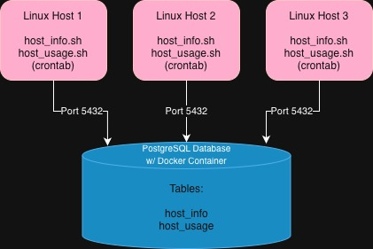

# Linux Cluster Monitoring Agent (LCM)

# Introduction
The Linux Cluster Monitoring Agent (LCM) is a monitoring system designed to track the 
performance and hardware specifications of Linux cluster nodes. It collects detailed 
information on CPU, memory, disk usage, and overall system health, storing the  data 
in a centralized PostgreSQL database. The primary users of this system are system 
administrators and IT teams responsible for managing multi-node Linux clusters, who need 
insights to optimize performance, plan capacity, and detect resource bottlenecks. The 
project leverages Bash for scripting, Docker for managing the database container, 
crontab for scheduling recurring monitoring tasks, and Git for version control and 
collaboration. Its modular design allows it to be easily extended to additional nodes 
and future metrics like network usage or application-specific monitoring.

## Quick Start
Follow these steps to quickly set up the monitoring system:

1. **Launch the PostgreSQL container**  
   ```bash
   bash psql_docker.sh create <db_username> <db_password>
   ```
   or start an existing container:
   ```bash
   bash psql_docker.sh start
   ```

2. **Create the database tables**  
   Set up the required `host_info` and `host_usage` tables:  
   ```bash
   psql -h localhost -U <db_username> -d host_agent -f ddl.sql

3. **Insert hardware specifications**
   Collect and store the hardware info of your host:
   ```bash
   bash host_info.sh "localhost" 5432 "host_agent" <db_username> <db_password>

4. **Collect initial system usage data**
   Run the usage script manually to populate the database:
   ```bash
   bash host_usage.sh "localhost" 5432 "host_agent" <db_username> <db_password>

5. **Automate usage monitoring with crontab**
   Schedule `host_usage.sh` to run every minute:
   ```bash
   crontab -e
   # add the following line:
   * * * * * bash <path_to_host_usage.sh> "localhost" 5432 "host_agent" <db_username> <db_password> &> /tmp/host_usage.log

After completing these steps, your system will automatically collect both hardware 
specifications and real-time usage data from all monitored nodes.

# Implementation
The system is composed of multiple Linux nodes, each running an agent that collects 
hardware and usage data. All data is sent to a centralized PostgreSQL database container.

## Architecture


## Scripts
### `psql_docker.sh`
Manages the PostgreSQL Docker Container.
  ```bash
  # Create a new DB container
  bash psql_docker.sh create <db_username> <db_password>

  # Start the container
  bash psql_docker.sh start

  # Stop the container
  bash psql_docker.sh stop
  ```

### `host_info.sh`
Collects static hardware specifications for each host and stores them in the `host_info` table.
  ```bash
  bash host_info.sh "localhost" 5432 "host_agent" <db_username> <db_password>
  ```

### `host_usage.sh`
Collects CPU, memory, and disk usage every minute and stores it in the `host_usage` table.
  ```bash
  bash host_usage.sh "localhost" 5432 "host_agent" <db_username> <db_password>
  ```

### crontab
Automates running host_usage.sh every minute.

## Database Modeling

### `host_info`
This table stores the static hardware specifications for each host in the cluster.

| Column           | Description |
|------------------|-------------|
| id               | Unique identifier for each host |
| hostname         | Name of the host machine |
| cpu_number       | Number of CPU cores |
| cpu_architecture | CPU architecture (x86_64, ARM, etc.) |
| cpu_model        | CPU model name |
| cpu_mhz          | CPU clock speed in MHz |
| l2_cache         | L2 cache size (KB) |
| timestamp        | Timestamp when the data was collected |
| total_mem        | Total memory available (MB) |

---

### `host_usage`
This table stores the dynamic, real-time usage metrics for each host.

| Column         | Description |
|----------------|-------------|
| timestamp      | Time when the data was collected |
| host_id        | Foreign key linking to `host_info` |
| memory_free    | Free memory available (MB) |
| cpu_idle       | Percentage of CPU idle time |
| cpu_kernel     | Percentage of CPU used by kernel processes |
| disk_io        | Number of disk blocks read/written per second |
| disk_available | Available disk space (MB) |

## Test

All components of the Linux Cluster Monitoring Agent were tested individually to ensure proper functionality:

- **`psql_docker.sh`**: Verified that the PostgreSQL Docker container can be created, started, and stopped successfully.  
- **`host_info.sh`**: Confirmed that hardware specifications are correctly collected and inserted into the `host_info` table.  
- **`host_usage.sh`**: Verified that CPU, memory, and disk usage metrics are accurately recorded in the `host_usage` table.  
- **`ddl.sql`**: Ensured that the `host_info` and `host_usage` tables are created correctly on an empty database.  
- **Crontab**: Confirmed that new entries are automatically added to the `host_usage` table every minute as scheduled.

Testing also included manual verification of inserted data to ensure correctness and consistency.

## Deployment

The Linux Cluster Monitoring Agent was deployed using **Docker**, **GitHub**, and **crontab** to ensure a consistent, automated monitoring setup.

### 1. Docker Setup
- The PostgreSQL database runs inside a **Docker container** managed with the `psql_docker.sh` script.
- Using Docker ensures the database environment is consistent across systems and isolated from the host machine.
- Data is persisted using a named Docker volume, so it remains even if the container is removed.

**Commands:**
  ```bash
  # Create a new PostgreSQL container
  bash psql_docker.sh create <db_username> <db_password>

  # Start an existing container
  bash psql_docker.sh start

  # Deployment can be verified using this to make sure the container is running and ready to receive data
  docker ps
  ```
### 2. GitHub
- All files were hosting on this GitHub repository for collaboration, version tracking and backup.
- A typical workflow included creating a new branch for each feature and then creating a pull request back into develop for review before merging into the main branch.

### 3. Automation using Crontab
- The `host_usage.sh` script is scheduled using crontab to run every minute so that there is continuous monitoring without manual execution.

## Improvements
Some potential future enhancements for the Linux Cluster Monitoring Agent may include:

- **Resource prediction and alerts** – Use historical data to predict when resources may become constrained and alert administrators in advance.  
- **Data retention and archiving** – Implement automated data cleanup or archiving to manage database size over time.   
- **Multi-cluster support** – Extend the system to monitor multiple clusters simultaneously.
